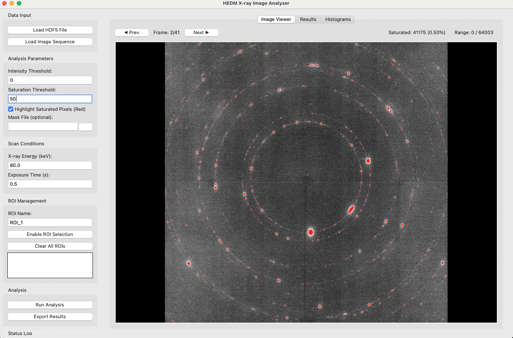
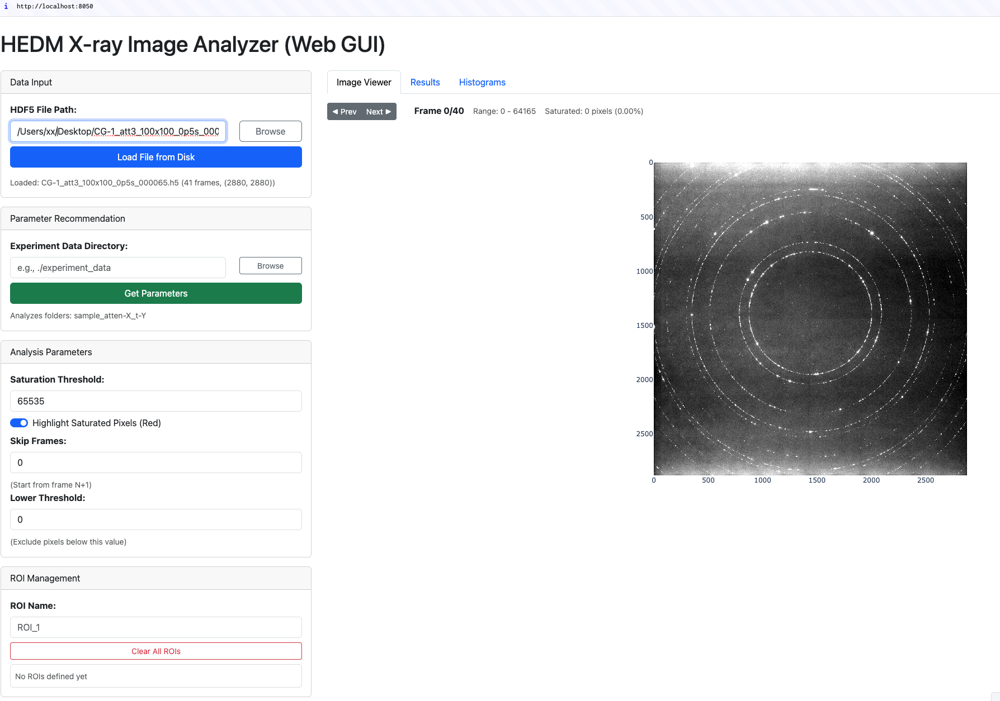

# HEDM X-ray Image Analyzer

A comprehensive Python application for analyzing High Energy Diffraction Microscopy (HEDM) X-ray detector data with statistical analysis, ROI management, and scan parameter optimization.

**Available in two GUI versions:**
- **Desktop GUI** (Tkinter) - Standalone desktop application with interactive image viewer



- **Web GUI** (Dash) - Browser-based interface for remote access and easier deployment



## Features

### Core Functionality
- **Multi-format Data Loading**: Support for HDF5 files, image sequences (PNG/TIFF), and single images
- **Statistical Analysis**: Comprehensive per-frame and per-ROI statistics (mean, median, std, percentiles)
- **ROI Management**: Interactive region-of-interest selection and analysis
- **Saturation Detection**: Automatic detection and reporting of saturated pixels
- **Histogram Generation**: Intensity distribution analysis with customizable binning
- **X-ray Physics**: Attenuation calculations and scan parameter recommendations

### Analysis Outputs
- **Statistics**: Per-frame and overall statistics for each ROI and global data
- **Histograms**: Intensity distribution plots for overall data and individual ROIs
- **Saturation Analysis**: Count and percentage of saturated pixels
- **Attenuation Reports**: Current attenuation factors based on material filters and X-ray energy
- **Parameter Recommendations**: Optimized exposure times and attenuation settings

## Installation

### Requirements

All dependencies are listed in `requirements.txt`. Install them with:

```bash
pip install -r requirements.txt
```

### Key Dependencies
- **Core**: NumPy, SciPy, Pillow, h5py, scikit-image
- **Desktop GUI**: Tkinter (usually included with Python)
- **Web GUI**: Dash, Dash Bootstrap Components, Plotly
- **Visualization**: Matplotlib

### Setup

#### Option 1: Desktop GUI (Tkinter)
```bash
cd hedm_analyzer
python3 main.py
```
The Tkinter interface will launch as a desktop application.

#### Option 2: Web GUI (Dash)
```bash
cd hedm_analyzer
python3 main_dash.py
```
The web application will be available at `http://localhost:8050` - open this URL in your web browser.

## Usage

### Common Workflow
Both GUI versions follow the same basic workflow:
1. Load data (HDF5 file or image sequence)
2. Set analysis parameters (threshold, saturation limit)
3. Define ROIs (Region of Interest)
4. Configure scan conditions (X-ray energy, exposure time, filters)
5. Run analysis to generate comprehensive report
6. Export results and view recommendations

### Desktop GUI (Tkinter)
The desktop interface provides:
1. **Data Input Panel**: Load HDF5 files or image sequences
2. **Parameter Controls**: Set threshold, saturation limits, and scan conditions
3. **Interactive Image Viewer**:
   - Click and drag to define ROIs directly on images
   - Zoom and pan controls
   - Saturation highlighting
4. **Real-time Visualization**: Histograms and statistical plots
5. **Export Tools**: Save results to JSON/CSV formats

**Starting the Desktop GUI:**
```bash
python3 main.py
```

### Web GUI (Dash)
The web interface provides:
1. **File Upload/Browse**: Upload HDF5 files directly or specify file paths
2. **Interactive Controls**: Web forms for all analysis parameters
3. **Parameter Recommendation**: Automated exposure time and filter optimization
4. **Web-based Visualization**: Plotly-based interactive charts and plots
5. **Remote Access**: Access from any browser on the network
6. **Export Functionality**: Download analysis results and recommendations

**Starting the Web GUI:**
```bash
python3 main_dash.py
```
Then navigate to `http://localhost:8050` in your web browser.

**For Remote Access:**
If running on a remote server, use port forwarding:
```bash
ssh -L 8050:localhost:8050 user@remote_server
```
Then access at `http://localhost:8050`

### Choosing a GUI

| Feature | Desktop GUI (Tkinter) | Web GUI (Dash) |
|---------|-------------------|----------|
| **Access** | Local only | Network/Remote access |
| **ROI Selection** | Click-and-drag on image | Web form input |
| **Visualization** | Matplotlib plots | Interactive Plotly charts |
| **File Upload** | Browse local filesystem | Upload or path input |
| **Installation** | Minimal (Tkinter often pre-installed) | Requires Dash/Flask packages |
| **Performance** | Direct native rendering | Browser-based |
| **Use Case** | Local analysis, interactive ROI selection | Remote servers, shared analysis |

**Quick Decision:**
- Choose **Desktop GUI** if you prefer direct mouse interaction with images and local analysis
- Choose **Web GUI** if you need remote access or prefer a modern web interface

### Input Parameters
- **File Input**: HDF5 files (`*.h5`) or image directories
- **Threshold**: Minimum intensity for analysis inclusion
- **Mask File**: Optional pixel exclusion mask (PNG/TIFF/text)
- **Scan Conditions**:
  - X-ray energy (keV)
  - Exposure time (seconds) 
  - Attenuation filter settings
  - Beam current and detector distance

## Data Format Support

### HDF5 Files (Recommended)
Expected structure following NeXus/TomoPy conventions:
```
/exchange/data          # Projection images (frames, height, width)
/exchange/bright        # Bright field images
/exchange/dark          # Dark field images
/measurement/           # Experimental metadata
```

### Image Sequences
- Supported formats: PNG, TIFF
- Files should be numbered sequentially
- All images must have the same dimensions

## Core Components

### DataHandler (`core/data_handler.py`)
- Multi-format file loading
- Metadata extraction from HDF5
- Mask application and preprocessing

### AnalysisEngine (`core/analysis_engine.py`)
- Statistical calculations
- ROI management and analysis
- Saturation detection
- Histogram generation

### AttenuationCalculator (`core/attenuation_calc.py`)
- X-ray physics calculations
- Material attenuation coefficients (Al, Fe, Cu, Pb)
- Exposure time recommendations
- Filter optimization suggestions

### GUI Components

#### Desktop GUI (`gui/main_window.py`)
- Tkinter-based desktop interface
- Interactive image viewer with ROI selection and saturation highlighting
- Real-time histograms and statistical visualization
- Direct file browsing and results export
- Suitable for local analysis with direct display

#### Web GUI (`gui_dash/`)
- Dash/Flask-based web server with Bootstrap styling
- File upload support (up to 1GB)
- Interactive web forms for all parameters
- Plotly-based interactive charts and visualization
- Parameter recommendation engine integration
- Remote access via web browser
- Suitable for remote servers or shared deployments

## Example Analysis Report

```json
{
  "analysis_parameters": {
    "threshold": 10.0,
    "saturation_threshold": 65535,
    "num_rois": 2
  },
  "overall_statistics": {
    "overall": {
      "mean": 11.19,
      "median": 6.0,
      "max": 64042,
      "std": 321.27
    }
  },
  "saturation_analysis": {
    "saturation_percentage": 0.001,
    "total_saturated_pixels": 847
  },
  "attenuation_analysis": {
    "total_attenuation_factor": 1.02,
    "recommendations": {
      "exposure": {
        "exposure_time_s": 1.34,
        "reasoning": "Scaled to achieve target mean counts"
      }
    }
  }
}
```

## Configuration

Sample configuration files are provided in `examples/`:
- `sample_config.json`: Example analysis parameters and ROI definitions

## Testing

Run the test suite:
```bash
python3 test_hedm_analyzer.py  # Full test suite
python3 quick_test.py          # Quick functionality test
```

## Parameter Recommendation System

### Overview

The **Parameter Recommendation** feature uses calibration data from controlled X-ray experiments to automatically calculate optimal exposure parameters for your specific beamline setup. It applies the Beer-Lambert law of X-ray attenuation to predict the maximum safe exposure times for different filter thicknesses.

### How It Works

The system performs the following steps:

1. **Data Collection**: You conduct a series of calibration experiments with different copper (Cu) filter thicknesses and exposure times, saving the resulting TIFF images in a standardized folder structure.

2. **Intensity Analysis**: For each calibration folder, the system:
   - Reads a representative sample of TIFF images
   - Extracts the maximum pixel intensity
   - Calculates the intensity rate: `Rate = Max_Intensity / Exposure_Time`

3. **Saturation Filtering**: Data points where the maximum intensity approaches the detector's saturation limit (typically 65535 for 16-bit detectors) are excluded to ensure accurate physics-based fitting.

4. **Physics-Based Regression**: The system fits the Beer-Lambert attenuation law:
   ```
   I = I₀ × exp(-μ × thickness)
   ```
   Where:
   - `I` = Intensity (counts/s)
   - `I₀` = Unattenuated flux (counts/s)
   - `μ` = Linear attenuation coefficient (/mm)
   - `thickness` = Cu filter thickness (mm)

   Using linear regression on the log-transformed data:
   ```
   ln(I) = ln(I₀) - μ × thickness
   ```

5. **Parameter Predictions**: Based on the fitted model, the system predicts:
   - Maximum intensity rate for each available filter thickness
   - Recommended maximum exposure time to stay safely below saturation (90% safety margin)

### Using Parameter Recommendation

#### In the Desktop GUI
1. Click **"Parameter Recommendation"** section (if available in your version)
2. Enter the path to your experiment data directory
3. Click **"Get Parameters"** to analyze the calibration data
4. Review the predicted maximum exposure times for each filter setting
5. Results show both the fitted physics model and individual predictions

#### In the Web GUI
1. Go to the **"Parameter Recommendation"** section
2. Enter the path to your experiment data directory (e.g., `./experiment_data` or a full path)
3. Click **"Get Parameters"** button
4. The system displays:
   - **Physics Model**: Calculated attenuation coefficient (μ) and unattenuated flux (I₀)
   - **Regression Plot**: Visual representation of measured data and fitted curve
   - **Predictions Table**: Recommended maximum exposure times for each filter thickness

### Experiment Data Collection & Naming Convention

#### Directory Structure

Calibration experiments should be organized in a parent directory (e.g., `experiment_data/`) with the following structure:

```
experiment_data/
├── sample_atten-0_t-0.5/
│   ├── proj_0000.tif
│   ├── proj_0020.tif
│   ├── proj_0040.tif
│   └── ...
├── sample_atten-1_t-1.0/
│   ├── proj_0000.tif
│   ├── proj_0020.tif
│   └── ...
├── sample_atten-3_t-1.5/
│   └── ...
└── ...
```

#### Folder Naming Convention

Calibration folders must follow the exact pattern:
```
sample_atten-{INDEX}_t-{EXPOSURE_TIME}
```

Where:
- `sample` = Prefix (literal text)
- `atten-{INDEX}` = Filter wheel position index (0, 1, 2, ..., 11)
- `t-{EXPOSURE_TIME}` = Exposure time in seconds (decimal number)

**Examples:**
- `sample_atten-0_t-0.5` = No filter (0.0 mm Cu), 0.5 second exposure
- `sample_atten-1_t-1.0` = Filter position 1 (0.5 mm Cu), 1.0 second exposure
- `sample_atten-5_t-2.0` = Filter position 5 (2.0 mm Cu), 2.0 second exposure

#### Filter Thickness Mapping

The attenuation index directly maps to Cu filter thicknesses. The system supports 12 positions (0-11):

| Atten Index | Cu Thickness (mm) |
|-------------|-------------------|
| 0 | 0.0 (no filter) |
| 1 | 0.5 |
| 2 | 1.0 |
| 3 | 1.5 |
| 4 | 2.0 |
| 5 | 2.39 |
| 6 | 4.78 |
| 7 | 7.14 |
| 8 | 9.53 |
| 9 | 11.91 |
| 10 | 14.30 |
| 11 | 16.66 |

> **Note**: You can customize the `AVAILABLE_THICKNESSES_MM` list in `core/parameter_optimizer.py` to match your specific filter wheel configuration.

#### Image File Naming Convention

Within each calibration folder, TIFF image files should follow the pattern:
```
proj_{FRAME_NUMBER}.tif
```

Where `{FRAME_NUMBER}` is a zero-padded integer (e.g., `proj_0000.tif`, `proj_0100.tif`).

**Example sequence:**
- `proj_0000.tif`
- `proj_0020.tif`
- `proj_0040.tif`
- `proj_0060.tif`
- ... (up to however many frames were captured)

The system automatically samples frames to avoid loading all data into memory (by default, checks ~10 frames).

#### Data Collection Best Practices

1. **Multiple Data Points Per Filter**: Collect multiple exposures at the same filter thickness with different exposure times to improve fitting accuracy:
   ```
   sample_atten-2_t-0.5/
   sample_atten-2_t-1.0/
   sample_atten-2_t-1.5/
   ```

2. **Avoid Saturation**: Ensure the maximum intensity in your calibration data doesn't reach saturation (< 65435 for 16-bit detectors). Saturated frames are automatically excluded and reduce fitting reliability.

3. **Cover the Range**: Use multiple filter thicknesses to get a good representation of the attenuation curve. At least 2-3 different thicknesses are required for regression fitting.

4. **Consistent Conditions**: Keep X-ray beam parameters (energy, beam current) consistent across all calibration experiments.

### Model Quality Metrics

The system provides an R² (coefficient of determination) value:
- **R² = 1.0**: Perfect fit
- **R² > 0.95**: Excellent fit (recommended)
- **R² > 0.90**: Good fit
- **R² < 0.90**: Data may be noisy; consider collecting more calibration points

### Interpreting Results

The output predictions table shows:
- **Atten Index**: Filter position on the wheel
- **Thickness (mm)**: Cu filter thickness
- **Predicted Rate (cts/s)**: Estimated maximum intensity rate at this filter setting
- **Max Time (s)**: Recommended maximum exposure time to achieve 90% of saturation limit

Example interpretation:
```
Atten Index  Thickness  Predicted Rate      Max Time
atten-0      0.0 mm     1.50e+05 cts/s     0.3932 s
atten-1      0.5 mm     1.18e+05 cts/s     0.5000 s
atten-2      1.0 mm     9.31e+04 cts/s     0.6335 s
```

This tells you that with the current beamline configuration, you can safely expose for:
- ~0.39 seconds without any filter
- ~0.50 seconds with 0.5 mm Cu filter
- ~0.63 seconds with 1.0 mm Cu filter

## Limitations

### Desktop GUI (Tkinter)
- Requires display server (X11/Wayland) - use SSH with X forwarding for remote access
- Limited to local network access
- Interactive ROI selection requires direct mouse input

### Web GUI (Dash)
- Single-user deployment (not optimized for concurrent users)
- Large file uploads may take time on slower connections
- Browser compatibility depends on Plotly support

### General
- Large datasets (>100 frames) may require significant memory
- Real-time EPICS PV support is planned but not yet implemented

## Future Enhancements

- Real-time data analysis with EPICS PV connections
- Advanced filtering and noise reduction
- 3D visualization capabilities
- Batch processing scripts
- Multi-user web interface with authentication
- Docker containerization for easier deployment

## Technical Details

- **Language**: Python 3.7+
- **Desktop GUI Framework**: Tkinter
- **Web GUI Framework**: Dash with Flask backend
- **Styling**: Dash Bootstrap Components
- **Scientific Computing**: NumPy, SciPy
- **Image Processing**: PIL/Pillow, scikit-image
- **Data I/O**: HDF5py
- **Visualization**: Matplotlib (desktop), Plotly (web)

## License

This software is provided for research and educational purposes.

## Contact

For questions or issues, please check the application logs (`hedm_analyzer.log`) for detailed error information.